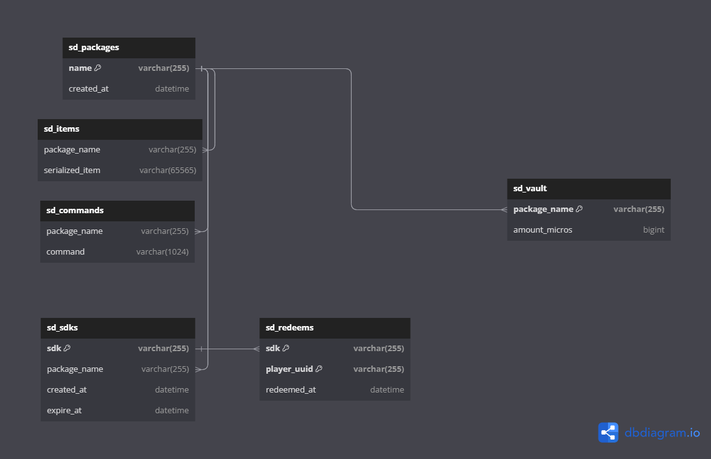

# SakuraRedeem
---
一个可以生成与兑换cdk的插件

### TODO
- [ ] 兑换者输入cdk 获得一个装着物品的箱子
- [ ] 兑换者输入cdk 执行某一段指令
- [ ] 兑换者输入cdk 获得vault钱币
- [ ] 兼容placeholder api
- [ ] Admin可以方便的编辑箱子里的物品
- [ ] 方便管理，可以接MySQL
- [ ] 可以批量添加以及通过yml导入
- [ ] 随机cdk和自定义cdk两种模式
- [ ] cdk有有效时间限制

#### [DataBase Structure](https://dbdiagram.io/d/64f2cdd002bd1c4a5ed691ef)

